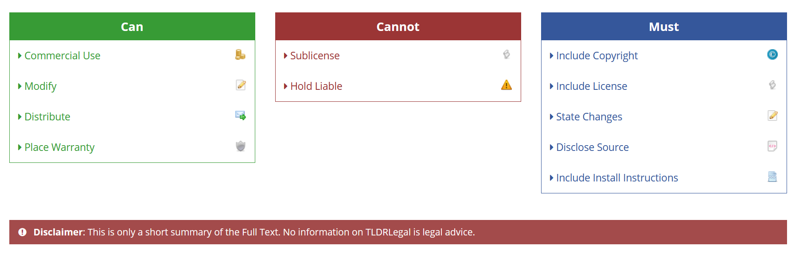

# Tresor-Import - The File Import of Tresor One

This is the PDF and PP-CSV Import used on [tresor.one](https://tresor.one).

## Supported Brokers

All brokers supported by tresor-import are listed in the [documentation](docs/implementations.md).

## Installation

```bash
npm install @tresor.one/import
```

## Usage

```js
import getActivities from '@tresor.one/import';

async fileHandler() {
  const results = await Promise.all(Array.from(this.$refs.myFiles.files).map(getActivities));
  results.forEach(result => {
    console.log(result);
  });
}
```

The function `getActivities` returns an objects with the following fields:

| Name       | Description                                                                                                                    |
| ---------- | ------------------------------------------------------------------------------------------------------------------------------ |
| file       | The file name of the input file.                                                                                               |
| activities | List of activities which was parsed from the input file. The activity object is broken down [here](docs/activity.md).          |
| status     | The status code which contains the information about the reason why no activities was found. For Details see the status table. |
| successful | The simple way to check if at least one activity was found and the status code is equals zero.                                 |

The status field can contains one of the following values, described [here](docs/status_code.md).

## How to calculate the amount

To understand the amount calculation please read the amount documentation [here (in German)](docs/amount.md).

## Contribute

To contribute:

1. fork the repo
2. install and start `npm i && npm start`
3. open the logged URL, usually [`http://localhost:5000`](http://localhost:5000), in your browser
4. Import a PDF. Content is shown in your Javascript console
5. Write a parser in `src/brokers` to parse that content - see `src/brokers/comdirect.js` for inspiration
6. Add and run all tests `npm t`
7. Create a Pull Request

# Licensing

Usage of this codebase is permitted according to the GNU Affero General Public License v3 (AGPL-3.0).

**HERE'S AN INCOMPLETE SUMMARY. READ THE [FULL LICENSE](LICENSE) BEFORE USING.**

- You are permitted to:
  - Use this codebase in any way you want including commercially
  - Modify and distribute the codebase in any way you want
- You MUST:
  - Respect the copyright which is held by the maintainers of this project
  - Disclose all changes you made to the code and also publish any code directly based on this code
  - Give attribution to the original maintainers when using this project (especially when used commercially)
- You can not
  - Sublicense this codebase
  - Expect any liability, warranty or similar by the original maintainers. However, we want to improve
    this project as much as possible so feedback is heard!

See also the following image, taken from [TL;DR Legal](https://www.tldrlegal.com/l/agpl3).

